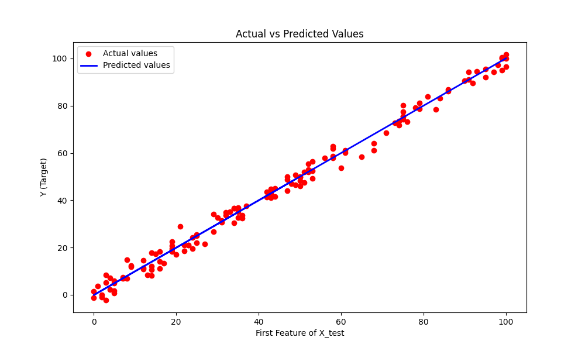
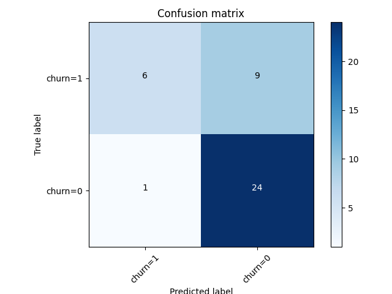
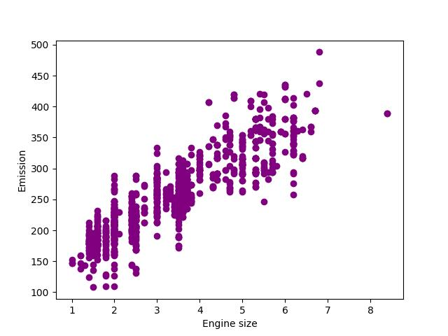

# Machine Learning Algorithms

This repository contains implementations and visualizations of various machine learning algorithms. Each script and notebook is designed to illustrate key concepts in machine learning, ranging from regression to classification tasks.

## Contents

### 1. **Linear Regression**
- **File:** `linear.py`
- **Description:** Implements a linear regression model using `scikit-learn` to predict target values based on a dataset. It includes:
  - Data preprocessing with `SimpleImputer` for missing values.
  - A pipeline for model training and testing.
  - Visualization of actual vs. predicted values.
- **Highlights:**
  - R² value for training evaluation.
  - Mean Absolute Percentage Error (MAPE) for accuracy on test data.



---

### 2. **Logistic Regression**
- **File:** `logistic.py`
- **Description:** Builds a logistic regression model for classification problems. This implementation includes:
  - Data normalization with `StandardScaler`.
  - Evaluation using metrics like confusion matrix and Jaccard index.
  - A plot of the confusion matrix.
- **Highlights:**
  - Classification report for model performance.
  - Visual representation of confusion matrix.



---

### 3. **Multiple Linear Regression**
- **File:** `Multiple.py`
- **Description:** Demonstrates multiple linear regression using a dataset on fuel consumption and CO₂ emissions. The script includes:
  - Scatter plot visualizations for training data.
  - Calculation of regression coefficients and variance score.
- **Highlights:**
  - Mean Squared Error (MSE) for model evaluation.
  - Visual insights into engine size vs. CO₂ emissions.



---

### 4. **Decision Trees**
- **Files:**
  - `Decision-Trees-drug.ipynb`
  - `Regression_Trees.ipynb`
- **Description:** Introduces decision trees for both classification and regression tasks.
  - The `Decision-Trees-drug` notebook classifies drug types based on patient attributes.
  - The `Regression_Trees` notebook predicts target values using tree-based models.
- **Highlights:**
  - Visualization of decision boundaries.
  - Tree structure insights.

---

### 5. **Support Vector Machines (SVM)**
- **File:** `classification_tree_svm.ipynb`
- **Description:** Explores SVM for classification tasks with detailed analysis and performance visualization.

---

## Requirements

To run the scripts and notebooks, the following Python libraries are required:
- `pandas`
- `numpy`
- `scikit-learn`
- `matplotlib`
- `seaborn`

Install the dependencies using:
```bash
pip install -r requirements.txt
```
## Usage

1. Clone the repository:
   ```bash
   git clone https://github.com/your_username/Machine_learning_algorithms.git
   ```
2. Navigate to the directory:
   ```bash
   cd Machine_learning_algorithms
   ```

3. Run the desired script or oprn the jupyter notebook:
   ```python
   python linear.py
   ```
   or
   ```python
   jupyter notebook Decision-trees-drug.ipynb
   ```

## Viduslization
  - Linear Regression: Actual vs. predicted values plot.
  - Logistic Regression: Confusion matrix.
  - Multiple Linear Regression: Scatter plots for training data and emissions.
  - Decision Trees: Tree visualizations for classification and regression tasks.

## Author
**Suraj B Rajolad**
